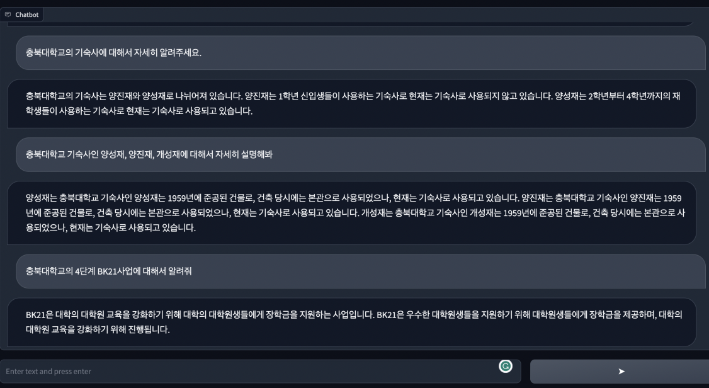

# Cullbot(Chungbuk national university large language model-based chatbot)

## Example



## Foundation Model 

Cullbot 은 Foudataion Model로 [Polyglot-ko-12.8B](https://huggingface.co/EleutherAI/polyglot-ko-12.8b)를 사용하여 학습을 진행했습니다.

## Model repository

[yeongsang2/polyglot-ko-12.8B-v.1.02-checkpoint-4500](https://huggingface.co/yeongsang2/polyglot-ko-12.8B-v.1.02-checkpoint-4500)
<aside>
💡 현재는 병합된 모델이 아닌 adapter로 제공되기 때문에, inference시 병합하면 됩니다.
</aside>

## Dataset

데이터셋은 공개되어있는 1. [구름 데이터셋](https://huggingface.co/datasets/nlpai-lab/kullm-v2)과 GPT3.5로 생성해낸 충북대 관련 2. QA set 4k (data_cbnu.json) 와 3. [대학백과](https://www.univ100.kr/)에서 크롤링한 데이터 4K (data_crwaling)를 합쳐 구성되어있습니다.

QA set 은 충북대학교 홈페이지에 있는 정보글을 바탕으로 GPT3.5가 "['instruction': ' ', 'input': '', 'output': '' ]" 형식로 생성해냈으며 자세한 내용은 [notion](https://www.notion.so/CBNU-73265e0cb4b7491d92c063c637170b70?pvs=4)과 [https://github.com/yeongsang2/instruction_ai.git](https://github.com/yeongsang2/instruction_ai.git)에 정리되어 있습니다. 

대학백과 크롤링 관련 코드는 [https://github.com/yeongsang2/crawling_univ](https://github.com/yeongsang2/crawling_univ)
에서 확인 할 수 있습니다. 

학습에 사용된 데이터셋에는 충북대관련 QA면 tag를 1로, 아니면 tag를 0으로 설정하여 학습시 다른 프롬프트가 들어가도록 하였습니다.

### QAset 생성 prompt
```
        You are an AI that generates data base information. 
        Create data of a specific structure based on the information I provide. 
        The information is as follows: 
        `
            {information}
        `
        The data structure is in the following JSON format. 
        `   
            {format}
        `
        Here are some examples of the data:
        `
            {example}
        `
        You need to comply with the following requirements.
        requirements:
        1. The output should be an appropriate response to the instruction and the input. Make sure the output is less than 100 words.
        2. The content of the generated data should not be duplicated.
        3. All data (instruction, input, output) should be written in Korean.
        4. Create 10 pieces of data and arrange them in a list format.
        5. Please provide the answer without interruption and within the limited token range.
        6. Not all instructions require input. For example, when a instruction asks about some general information, "what is the highest peak in the world", it is not necssary to provide a specific context. In this case, we simply put "" in the input field.
        """
```
 
 ## Training with lora

Cullbot은 Polyglot 12.8B 모델을 Low Rank Adaptation (LoRA)를 사용하여 학습하였습니다.
모델 학습은 A100 80GB 4대로 진행했습니다. 학습에 사용한 코드는 [tloen/alpaca-lora](https://github.com/tloen/alpaca-lora)을 기반으로 사용하였습니다.

### Denpendency
```
pip install -r requirements.txt
``` 

### training single gpu
train.sh

```
nohup python finetune_lora_cbnu.py \
    --base_model 'EleutherAI/polyglot-ko-12.8b' \
    --data_path '' \
    --output_dir output/ \
    --prompt_template_name cbnu2 \
    --batch_size 128 \
    --micro_batch_size 12 \
    --num_epochs 3 \
    --learning_rate 3e-4 \
	--optim "adamw_torch" \
    --cutoff_len 512 \
    --val_set_size 1000 \
    --lora_r 8 \
    --lora_alpha 16 \
    --lora_dropout 0.05 \
    --lora_target_modules "[query_key_value, xxx]" \
    --train_on_inputs True \
    --logging_steps 5 \
    --save_steps 100 \
    --eval_steps 100 \
    --warmup_steps 100 \
    --lr_scheduler_type "linear"  &
```

### training multi-gpu 
train.sh
```
python -m torch.distributed.launch  --master_port=34322 --nproc_per_node $gpu_num finetune_lora_cbnu.py \
    --base_model 'EleutherAI/polyglot-ko-12.8b' \
    --data_path "" \
    --output_dir output/ \
    --prompt_template_name cbnu2 \
    --batch_size 128 \
    --micro_batch_size 12 \
    --num_epochs 3 \
    --learning_rate 3e-4 \
	--optim "adamw_torch" \
    --cutoff_len 512 \
    --val_set_size 2000 \
    --lora_r 8 \
    --lora_alpha 16 \
    --lora_dropout 0.05 \
    --lora_target_modules "[query_key_value, xxx]" \
    --train_on_inputs True \
    --logging_steps 10 \
    --save_steps 1000 \
    --eval_steps 100 \
    --lr_scheduler_type "linear" \
	--warmup_steps 200 
```

### 실행
```
sh train.sh
```

## Demo

demo.py
```
if __name__ == "__main__":
    gc.collect()
    torch.cuda.empty_cache()

    MODEL = "EleutherAI/polyglot-ko-12.8b"
    LORA_WEIGHTS = "yeongsang2/polyglot-ko-12.8B-v.1.02-checkpoint-4500"

    model = AutoModelForCausalLM.from_pretrained(MODEL, load_in_8bit=True,device_map={"":0})
    model = PeftModel.from_pretrained(model, LORA_WEIGHTS)
    model.eval()

    pipe = pipeline("text-generation", model=model, tokenizer=MODEL)
    prompter = Prompter("cbnu2")

    demo.launch(server_name="0.0.0.0", server_port=5000)
```
### 실행
```
    python demo.py
```
<hr>