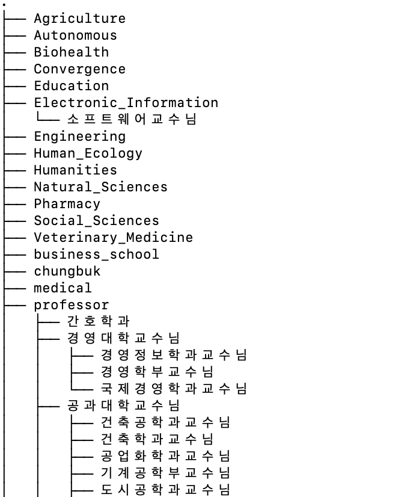
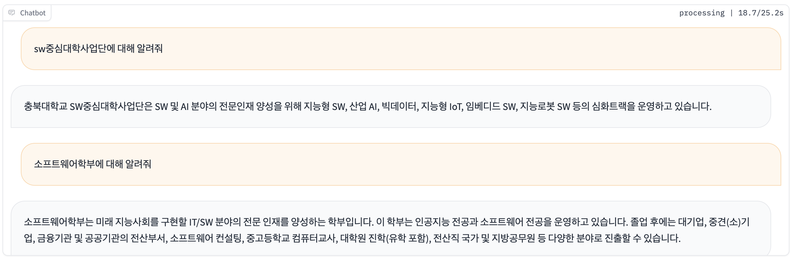

# Culbot Training
## 목차
1. [Enviroment](#enviroment)
2. [Data](#Data)
3. [Training](#Training)
4. [RAG](#RAG)
5. [Demo](#Demo)

## Enviroment

### Private Cloud

SW중심대학사업단에서 제공받은 연구실 서버를 활용하려면 아래와 같이 ssh 접속을 하시면됩니다.
```
ssh compu@113.198.xxx.xxx -p 10022 
passwd: ****
```
보안을 위해 10022번 port가 개방되어있으며 추가로 8081번 port가 개방되어 있습니다.<br>
해당 머신은 A6000 * 4 로 셋팅되어있습니다. <br>

```
    nvidia-smi
```
해당 명령어를 통해 GPU가 잘 세팅되어있는지 확인할 수 있습니다.
[!gpu](./gpu.png)

#### Enviroment
* Ubuntu 20.04 LTS
* python 3.9.13

### Public cloud
GCP(Google cloud platform)을 환경에서 진행하는 방법입니다.

#### 환경
* server : GCP (google cloud platform)
* GPU : L4 (VRAM : 24GB)
* backbone mode : https://huggingface.co/EleutherAI/polyglot-ko-12.8b
* python 3.10.12

#### 학습환경 구성
#### 할당량 수정하기

초기에 l4 gpus_all_regions의 할당값이 0으로 되어있기 때문에 할당량 수정에서 0->1 로 할당량 증가 요청을 해줍니다.
(아마 1개는 바로 할당해주는걸로 알고있습니다.)

#### 인스턴스 만들기
comput engine -> VM instance -> instance만들기를 눌러줍니다.


머신구성 -> GPU

NVIDIA l4 GPU를 사용할거기 떄문에 머신유형 NVIDIA l4를 눌러줍니다.
region은 가능한 곳에서 해주면됩니다(https://cloud.google.com/compute/docs/gpus/gpu-regions-zones)


부팅 디스크에서 변경 버튼을 눌러줍니다.


* 운영체제 : Ubuntu 
* 버전 : Ubuntu 20.04 LTS
* 크기 : 128GB 

#### 참고
자동으로 Deep learning학습에 필요한 GPU driver나 toolkit들을 설치하는 프로세스를 밟아주는 Deep learing on Linux 운영체제가 있는데 l4 GPU에서는 nivida-smi로 확인해보았을때 GPU가 정상적으로 인식이 안 되어서 Ubuntu운영체제로 진행했습니다.
(V100같은 다른 gpu는 Deep learning on Linux로 했을때 잘됨,,혹시 이유를 알면 댓글부탁드립니다.)

설정이 완료되었다면 만들기 버튼을 눌러주면됩니다.


잘 생성이 되었으면 이렇게 VM인스턴스에 뜹니다. 그 후 SSH 버튼을 눌르면 웹상에서 SSH접속이 됩니다.

#### CUDA TOOLKIT 설치
https://cloud.google.com/compute/docs/gpus/install-drivers-gpu

공식 홈페이지를 참고하여 CUDA TOOLKIT을 설치해줍니다.

Linux: CUDA Tookit 12.1 (https://developer.nvidia.com/cuda-12-1-0-download-archive?target_os=Linux&target_arch=x86_64&Distribution=Ubuntu&target_version=20.04&target_type=deb_network)


installation instructions에 있는대로 터미널에 입력해주시면 됩니다.
```
nvidia-smi
```
정상적으로 설치되었을때


#### CONDA 설치
python 버전 및 라이브러리 관리를 위해 conda를 설치합니다.

https://velog.io/@tube-jeonghoon/Ubuntu에-anaconda-설치하기
위 블로그를 참고하여 설치했습니다.

설치가 완료되었으면
```
source anaconda3/bin/activate
```
conda를 활성화해줍니다.

```
(base) user@instance-1:~$
```
이런식으로 활성화 되어야합니다.

```
conda create -n "가상환경이름" python="version"
```
위 환경은 python 3.10.12에서 진행했으므로
python=3.10.12를 적어주시면됩니다.

```
conda activate "가상환경이름"
```

#### 저장소
```
git clone https://github.com/yeongsang2/my_alpaca
```

https://github.com/tloen/alpaca-lora
https://github.com/nlpai-lab/KULLM
해당 프로젝트에 있는 코드는 위에있는 저장소를 참고하였습니다.

#### 라이브러리 설치
```
pip install - requirements.txt
```
의존하는 하는 라이브러리들을 설치해줍니다.

#### wandb 연동
wandb와의 연동을 원한다면
https://wandb.ai/site에 가입하여 API KEY를 발급받으면 됩니다.

```
wandb login
```
terminal에 wandb login을 입력후 발급받은 API KEY를 입력하면 됩니다. (한번 입력하면 로컬저장소에서 캐싱하여 로그인이 필요할시 자동으로 로그인 됩니다.)
#### 관리자 권한 실행
관리자 권한으로 실행안할시 permission 관련 error 발생하기 때문에,,(저는)

관리자 권한의 계정으로 변경해줍니다. 

#### 비밀번호 설정
```
sudo passwd
```
#### 권한 변경
```
su
```
권항 변경시 conda가 비활성화된다면  source anaconda3/bin/activate로 다시 활성화 해주면 됩니다.

#### 학습 실행
##### python finetune_lora.py
SSH 연결이 끊기더라도 학습을 유지하기 위해 nohup ~ & 로 파일을 실행시켜줍니다.
```
nohup python finetune_lora.py \
    --base_model 'EleutherAI/polyglot-ko-12.8b' \
    --data_path 'data_path' \
    --output_dir output/ \
    --prompt_template_name cbnu \
    --batch_size 128 \
    --micro_batch_size 2 \
    --num_epochs 5 \
    --learning_rate 3e-4 \
	--optim "adamw_torch" \
    --cutoff_len 1024 \
    --val_set_size 1000 \
    --lora_r 8 \
    --lora_alpha 16 \
    --lora_dropout 0.05 \
    --lora_target_modules "[query_key_value, xxx]" \
    --train_on_inputs \
    --logging_steps 10 \
    --save_steps 100 \
    --eval_steps 100 \
    --warmup_steps 100 \
    --lr_scheduler_type "linear" \ &
```
위 hyperparameter로 실행하면 19GB(VRAM)정도 사용합니다.

>cutoff_len과 miciro_batch_size 설정값에 의해 학습가능여부가 달라집니다. cutoff_len 1024 기준 micro_batch_size를 4이상으로 설정하면 OOM(out ot memory)가 발생합니다. (24GB VRAM기준)

### 모니터링

학습을 모니터링하기 위해선
```
cat nohub.out
```

또는 
wandb(https://wandb.ai/site)에서 모니터링 하면 됩니다.

예시


참고
* https://github.com/yeongsang2/my_alpaca
* https://github.com/tloen/alpaca-lora
* https://github.com/nlpai-lab/KULLM

## Data

### Dataset

데이터셋은 공개되어있는 1. [구름 데이터셋](https://huggingface.co/datasets/nlpai-lab/kullm-v2)과 GPT3.5로 생성해낸 충북대 관련 2. QA set 4k (data_cbnu.json) 와 3. [대학백과](https://www.univ100.kr/)에서 크롤링한 데이터 4K (data_crwaling)를 합쳐 구성되어있습니다.

### Data Generation

QA set 은 충북대학교 홈페이지에 있는 정보글을 바탕으로 GPT3.5가 "['instruction': ' ', 'input': '', 'output': '' ]" 형식로 생성해냈으며 자세한 내용은 [notion](https://www.notion.so/CBNU-73265e0cb4b7491d92c063c637170b70?pvs=4)과 [https://github.com/yeongsang2/instruction_ai.git](https://github.com/yeongsang2/instruction_ai.git)에 정리되어 있습니다. 

#### QAset 생성 prompt 
```
        You are an AI that generates data base information. 
        Create data of a specific structure based on the information I provide. 
        The information is as follows: 
        `
            {information}
        `
        The data structure is in the following JSON format. 
        `   
            {format}
        `
        Here are some examples of the data:
        `
            {example}
        `
        You need to comply with the following requirements.
        requirements:
        1. The output should be an appropriate response to the instruction and the input. Make sure the output is less than 100 words.
        2. The content of the generated data should not be duplicated.
        3. All data (instruction, input, output) should be written in Korean.
        4. Create 10 pieces of data and arrange them in a list format.
        5. Please provide the answer without interruption and within the limited token range.
        6. Not all instructions require input. For example, when a instruction asks about some general information, "what is the highest peak in the world", it is not necssary to provide a specific context. In this case, we simply put "" in the input field.
        """
```

### Data Collection

대학백과 크롤링 관련 코드는 [https://github.com/yeongsang2/crawling_univ](https://github.com/yeongsang2/crawling_univ)
에서 확인 할 수 있습니다. 

## Training

Cullbot은 Polyglot-ko 12.8B 모델을 Low Rank Adaptation (LoRA)를 사용하여 학습하였습니다.

### Foundation Model

[Polyglot-ko 12.8B](https://huggingface.co/EleutherAI/polyglot-ko-12.8b)

### Training

모델 학습은 A6000 48GB 4대로 진행했습니다. 학습에 사용한 코드는 [tloen/alpaca-lora](https://github.com/tloen/alpaca-lora)을 기반으로 사용하으며 학습에 소요된 시간은 8epoch 기준 약 200H 소요되었습니다.

#### Training with single GPU
다음은 single gpu시 사용되는 train.sh 스크립트 파일입니다.
```
    nohup python finetune_lora_cbnu.py \
    --base_model 'EleutherAI/polyglot-ko-12.8b' \
    --data_path '' \
    --output_dir output/ \
    --prompt_template_name cbnu2 \
    --batch_size 128 \
    --micro_batch_size 12 \
    --num_epochs 3 \
    --learning_rate 3e-4 \
	--optim "adamw_torch" \
    --cutoff_len 512 \
    --val_set_size 1000 \
    --lora_r 8 \
    --lora_alpha 16 \
    --lora_dropout 0.05 \
    --lora_target_modules "[query_key_value, xxx]" \
    --train_on_inputs True \
    --logging_steps 5 \
    --save_steps 100 \
    --eval_steps 100 \
    --warmup_steps 100 \
    --lr_scheduler_type "linear"  &
```

#### Training with multi gpu
다음은 실제로 학습에 사용된 train.sh 스크립트 파일입니다. 

```
python -m torch.distributed.launch  --master_port=34322
    --nproc_per_node $gpu_num finetune_lora.py \
    --base_model 'EleutherAI/polyglot-ko-12.8b' \
    --data_path "" \
    --output_dir output/ \
    --prompt_template_name cbnu \
    --batch_size 128 \
    --micro_batch_size 8 \
    --num_epochs 8 \
    --learning_rate 3e-4 \
	--optim "adamw_torch" \
    --cutoff_len 1024 \
    --val_set_size 2000 \
    --lora_r 8 \
    --lora_alpha 16 \
    --lora_dropout 0.05 \
    --lora_target_modules "[query_key_value, xxx]" \
    --train_on_inputs False \
    --logging_steps 10 \
    --save_steps 1000 \
    --eval_steps 100 \
    --lr_scheduler_type "linear" \
	--warmup_steps 100
```
주요 파라미터로는 micro_batch_size 는 8로 지정하였고, cutoff_len (max_length)는 1024로 지정하였습니다. 위 두가지의 값이 VRAM에 미치는 영향이커 OOM(out out memory)의 원인이 될 수 있으므로 두 값을 잘 조정하는게 중요합니다. <br>
위와 같이 셋팅하였을시 약 40/48 GB VRAM 정도 사용하게 됩니다.

## RAG

Culbot은 더 객관성있고 신뢰성있는 답변, 정보제공을 위해 RAG(retrieval augmented generation)방식을 사용합니다. RAG에 사용되는 데이터는 각 단과대 학과별정보와 충북대학교 소속의 교수님들의 문서정보로 chunk 됩니다.

<strong>문서구조</strong>


### Rag Data Generation

.env 파일을 작성해줍니다.
```
    LLM_MODEL=gpt-3.5 # alternatively, gpt-4, text-davinci-003, etc
    OPENAI_API_KEY=''
    OPENAI_TEMPERATURE=0.0

```


```
충북대학교 SW중심사업단

위치 : 충청북도 청주시 서원구 충대로1(개신동) , 학연산공동기술연구원(E9동) 742호

교육목표
SW 및 AI 분야의 전문인재 양성을 위해 지능형 SW, 산업 AI, 빅데이터, 지능형 IoT, 임베디드 SW, 지능로봇 SW 등의 심화트랙을 운영하고 있습니다. 차별화된 SW교육을 위해 7-Up SW 교육혁신모델, 산학멘토·가디언 기반의 산학협력 및 창업교육, 오픈소스SW 특화프로그램 등을 지원하고 있습니다.
재학생 전체에 대한 기초SW교육 뿐만 아니라 빅데이터, 보안컨설팅, 스마트자동차공학, 뇌인지공학, 공공데이터사이언스, 스마트 팩토리, 스마트 전력IT, 스마트 디자인, 스마트 도시 등의 융합과정을 지원하여 SW융합 인재 양성에 기여하고 있습니다.
또한 충청북도의 초·중·고등학생 및 대학생, 청소년, 일반인, 재직자 등을 대상으로 SW 리터러시 강화를 위한 다양한 프로그램을 온·오프라인으로 제공하고 있습니다. 충청북도의 거점대학으로서 지역의 지능SW 역량 강화를 위해 산업체와 공동연구 및 기술지원 체계 구축으로 산업 경쟁력 제고에 최선을 다해 노력하고 있습니다.
꾸준한 노력과 변화로 미래를 위한 인재양성과 충북 지역의 SW리터러시 향상에 기여하는 충북대학교 SW중심대학 사업단이 되겠습니다. 감사합니다.

```
위와 같은 문서데이터들을

```
    {
        "fileName": "sw중심대학사업단",
        "content": "충북대학교 SW중심사업단\n\n위치 : 충청북도 청주시 서원구 충대로1(개신동) , 학연산공동기술연구원(E9동) 742호\n\n교육목표\nSW 및 AI 분야의 전문인재 양성을 위해 지능형 SW, 산업 AI, 빅데이터, 지능형 IoT, 임베디드 SW, 지능로봇 SW 등의 심화트랙을 운영하고 있습니다. 차별화된 SW교육을 위해 7-Up SW 교육혁신모델, 산학멘토·가디언 기반의 산학협력 및 창업교육, 오픈소스SW 특화프로그램 등을 지원하고 있습니다.\n재학생 전체에 대한 기초SW교육 뿐만 아니라 빅데이터, 보안컨설팅, 스마트자동차공학, 뇌인지공학, 공공데이터사이언스, 스마트 팩토리, 스마트 전력IT, 스마트 디자인, 스마트 도시 등의 융합과정을 지원하여 SW융합 인재 양성에 기여하고 있습니다.\n또한 충청북도의 초·중·고등학생 및 대학생, 청소년, 일반인, 재직자 등을 대상으로 SW 리터러시 강화를 위한 다양한 프로그램을 온·오프라인으로 제공하고 있습니다. 충청북도의 거점대학으로서 지역의 지능SW 역량 강화를 위해 산업체와 공동연구 및 기술지원 체계 구축으로 산업 경쟁력 제고에 최선을 다해 노력하고 있습니다.\n꾸준한 노력과 변화로 미래를 위한 인재양성과 충북 지역의 SW리터러시 향상에 기여하는 충북대학교 SW중심대학 사업단이 되겠습니다. 감사합니다.\n\n"
    },
```

위와 같은 json 파일형태의 데이터로 만들어 줍니다.<br>

사용된 코드

```
import os
import json

import sys
import unicodedata
import chardet
from unicodedata import normalize

def create_json(dir_path):
    # Iterate through the files in the directory
    file_list = os.listdir(dir_path)
    data_list = []  # Initialize an empty list to store JSON objects

    # Process each file
    for file_name in file_list:
        if file_name.endswith(".txt"):
            file_path = os.path.join(dir_path, file_name)
            with open(file_path, "r",encoding="utf-8") as f:
                content = f.read()

            test = normalize('NFC', file_name[:-4])
            print(len(test))
            print(test)
            # print(len(normalize('NFC', file_name[:-4])))
            json_object = {
                "fileName": test,  # Extract filename without extension
                "content": content
            }

            data_list.append(json_object)  # Add the JSON object to the list

    # Convert the list of JSON objects to a JSON-formatted string
    # json_data = json.dumps(data_list, indent=4)

    # Save the JSON data to a file
    json_path = os.path.join(dir_path, "data_cbnu.json")
    with open(json_path, "w") as f:
        json.dump(data_list, f, ensure_ascii=False, indent=4)

if __name__ == "__main__":
    dir_path = ""
    create_json(dir_path)
```

그후 file name에 대한 question을 만들어줍니다.

```
    {
        "fileName": "sw중심대학사업단",
        "content": "충북대학교 SW중심사업단\n\n위치 : 충청북도 청주시 서원구 충대로1(개신동) , 학연산공동기술연구원(E9동) 742호\n\n교육목표\nSW 및 AI 분야의 전문인재 양성을 위해 지능형 SW, 산업 AI, 빅데이터, 지능형 IoT, 임베디드 SW, 지능로봇 SW 등의 심화트랙을 운영하고 있습니다. 차별화된 SW교육을 위해 7-Up SW 교육혁신모델, 산학멘토·가디언 기반의 산학협력 및 창업교육, 오픈소스SW 특화프로그램 등을 지원하고 있습니다.\n재학생 전체에 대한 기초SW교육 뿐만 아니라 빅데이터, 보안컨설팅, 스마트자동차공학, 뇌인지공학, 공공데이터사이언스, 스마트 팩토리, 스마트 전력IT, 스마트 디자인, 스마트 도시 등의 융합과정을 지원하여 SW융합 인재 양성에 기여하고 있습니다.\n또한 충청북도의 초·중·고등학생 및 대학생, 청소년, 일반인, 재직자 등을 대상으로 SW 리터러시 강화를 위한 다양한 프로그램을 온·오프라인으로 제공하고 있습니다. 충청북도의 거점대학으로서 지역의 지능SW 역량 강화를 위해 산업체와 공동연구 및 기술지원 체계 구축으로 산업 경쟁력 제고에 최선을 다해 노력하고 있습니다.\n꾸준한 노력과 변화로 미래를 위한 인재양성과 충북 지역의 SW리터러시 향상에 기여하는 충북대학교 SW중심대학 사업단이 되겠습니다. 감사합니다.\n\n",
        "question": "sw중심대학사업단에 대해 알려주세요"
    },
```

사용된 코드
```
import json

def main():

    data_test_path = "/"
    with open(data_test_path, 'r', encoding="utf-8") as file:
        data_test = json.load(file)
    
    output_list = []
    
    for i, d in enumerate(data_test):
        test = str(d['fileName'])
        question = test
        if(len(test) == 3):
            question += " 교수님에 대해 알려주세요"
        else:
            question += "에 대해 알려주세요"
        
        output_list.append({"id": i, "fileName" : d['fileName'], "content": d['content'], "question": question})
    
    with open('', "w", encoding="utf-8") as json_file:
        json.dump(output_list, json_file, ensure_ascii=False, indent=4)

if __name__ == "__main__":
    main()
```

생성된 question에 대하여 임베딩해 question_vector 를 만들어 줍니다. 상세 코드는 embedding.ipynb 참조

최종적으로 생성된 json파일 형태
```
        {
        "id" : "1",
        "fileName": "sw중심대학사업단",
        "content": "충북대학교 SW중심사업단\n\n위치 : 충청북도 청주시 서원구 충대로1(개신동) , 학연산공동기술연구원(E9동) 742호\n\n교육목표\nSW 및 AI 분야의 전문인재 양성을 위해 지능형 SW, 산업 AI, 빅데이터, ............
        ,
        "question": "sw중심대학사업단에 대해 알려주세요",
        "question_vector" : [
            0.0041118981,
            -0.0072956174,
            ...
            -0.0072956174,
        ]
    },
```

### how to apply

RAG시 vectorDB에 사용자의 질문과 유사한 document를 가져옵니다. 이때 document의 question과의 cosine similarity에 기반하여 가져옵니다. 불러올 json파일의 경로를 지정해 주면 됩니다.

```
import pandas as pd
from chromadb.utils.embedding_functions import OpenAIEmbeddingFunction

df = pd.read_json('')
df = df.astype({'vector_id':'str'})

chroma_client = chromadb.Client()
embedding_function = OpenAIEmbeddingFunction(api_key=os.getenv("OPENAI_API_KEY"), model_name='text-embedding-ada-002')
question_collection = chroma_client.create_collection(name='question', embedding_function=embedding_function)

batch_size = 166
chunks = [df[i:i + batch_size] for i in range(0, len(df), batch_size)]

def query_collection(collection, query, max_results, dataframe):
    results = collection.query(query_texts=query, n_results=max_results, include=['distances']) 
    df = pd.DataFrame({
                'id':results['ids'][0], 
                'score':results['distances'][0],
                'fileName': dataframe[dataframe.vector_id.isin(results['ids'][0])]['fileName'],
                'content': dataframe[dataframe.vector_id.isin(results['ids'][0])]['content'],
                'question': dataframe[dataframe.vector_id.isin(results['ids'][0])]['question'],
                })
    return df

output = query_collection(
        collection=question_collection,
        query=message,
        max_results=1,
        dataframe=df
        )
```


## Demo

```
  python demo_rag.py
```
